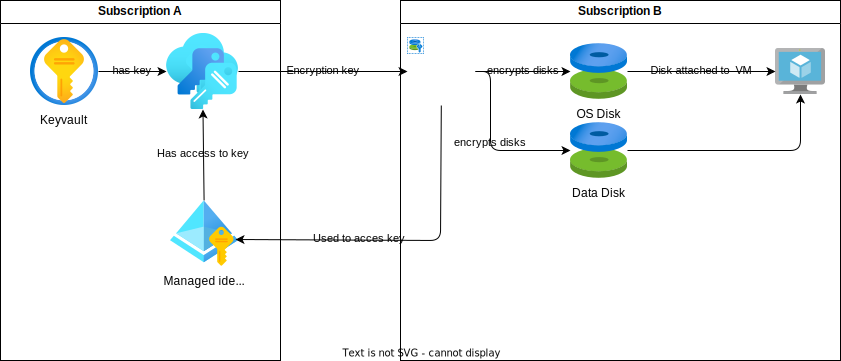
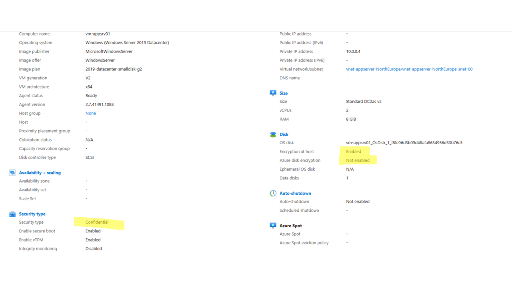
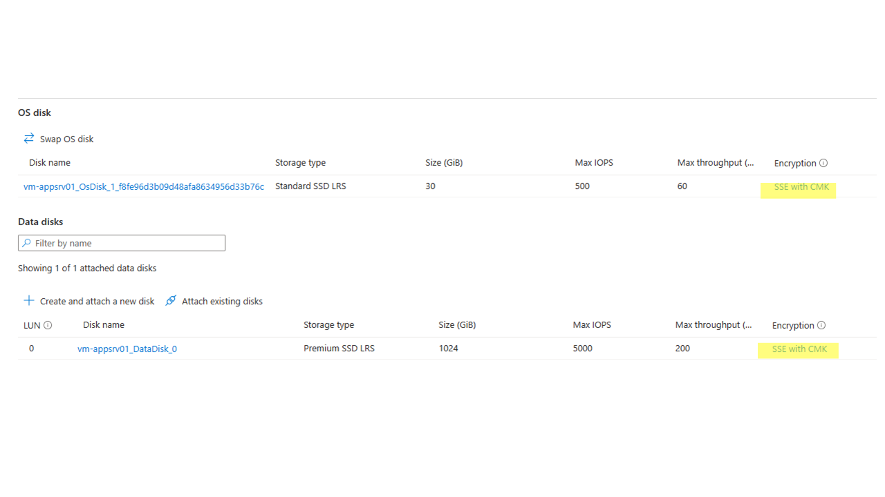

# Goal
To demonstrate best practices for confidential compute scenarios, in scenarios where the Customer Managed Key (CMK) used for disk encryption is in another subscription or even another tennant.  

# Prerequisites
- Have a keyvault with a key for disk encryption, mak sure tje keyvault has purge protection enabled.
- Have a user assigned managed identity that has the "Key Vault Crypto Service Encryption User" role on the Key Vault.
- 

# Disk Encryption types
https://learn.microsoft.com/en-us/azure/virtual-machines/disk-encryption-overview
## Azure Disk Storage Server-Side Encryption
https://learn.microsoft.com/en-us/azure/virtual-machines/disk-encryption
- Not compatible with encryption at host
- Temp disks are not encrypted, if you want to encrypt temp disks use encryption at host.
- Works with a disk encryption key set, Keys do not need to be in the same subscription.
- PREVIEW: Keys do not need to be in the same tennant: https://learn.microsoft.com/en-us/azure/virtual-machines/disks-cross-tenant-customer-managed-keys?tabs=azure-portal
- More restrictions apply: https://learn.microsoft.com/en-us/azure/virtual-machines/disk-encryption#restrictions

## Encryption at Host
https://learn.microsoft.com/en-us/azure/virtual-machines/disk-encryption#encryption-at-host---end-to-end-encryption-for-your-vm-data
- Not compatible with Azure Disk Storage Server-Side Encryption
- Not compatible with Azure Disk Encryption (guest-VM encryption using bitlocker/DM-Crypt)
- You need to enable this on your subscription first: https://learn.microsoft.com/en-us/azure/virtual-machines/linux/disks-enable-host-based-encryption-cli 
- Temp disks & disk cache are encrypted as well
- Works with a disk encryption key set, Keys do not need to be in the same subscription.

## Azure Disk Encryption
https://learn.microsoft.com/en-us/azure/virtual-machines/linux/disk-encryption-overview
https://learn.microsoft.com/en-us/azure/virtual-machines/windows/disk-encryption-overview

- Requires that the keyvault where the CMK is stored is in the same region and subscription as the VM.
- Cannot work on custom Linux Images.  
In general, this is to restrictive and therefore not used in our scenarios.

## Confidential disk encryption (For the OS disk only)
- Works with a disk encryption key set, Keys do not need to be in the same subscription.
- Only works with confidential VM's (DCasv5 and ECasv5)
- The OS Disk is bound to the TPM chip of the VM, you cannot attach the OS disk to another VM.  This offer additional security, when someone is able to get (a copy of) the disk, he cannot use it or read any data of it.
This offers great additiona security
- Azure Backup is limited in such way that it's curently not usable with CMK. https://learn.microsoft.com/en-us/azure/backup/backup-support-matrix-iaas#vm-compute-support.  Use database backup tools like RMAN for Oracle or T-SQL for MS SQL to backup the databases.

## Considerations
- You can choose the encryption mechanism for each disk individualy
- If you want to use a Customer Managed Key, you need to use a Disk Encryption Set
- You can use the Disk Encryption Set for more than 1 disk, in that case all disks are encrypted by the same key, recommend to use one Disk Encryption Set per VM.

# README Points
Below you find the references in the Bicep code and portal screeshots explained
1. The default is false.  When set to true, encryption at host level will take place.  You first need to activate this capability on the subscription.  If you want to use a CMK for the encryption, the OS disk must have a disk encryption set configured.
1. The default is platform managed key, if you add the code block `diskEncryptionSet: {} ` you enable the use of a disk encryption set and thus add the option of using a CMK for encripting your OS disk.
1.  The default is platform managed key, if you add the code block `diskEncryptionSet: {} ` you enable the use of a disk encryption set and thus add the option of using a CMK for encripting your data disk.  Note that you have to do this for each data disk.
1. Enable confidential VM, on selected VM Types (DCasv5 or ECasv5)
1. Select a confidential VM Type here (DCasv5 or ECasv5)

# Result
## Virtual Machine

- The security type is confidential
- Encryption at host encryption method selected, you cannot have both

## Disks

Both disks are encrypted.